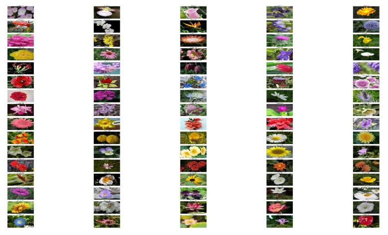
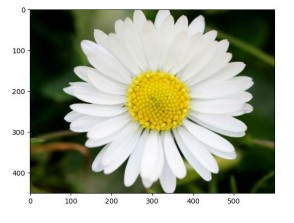
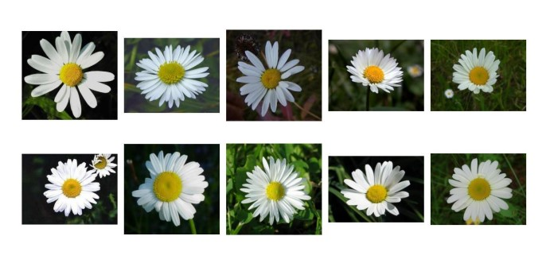
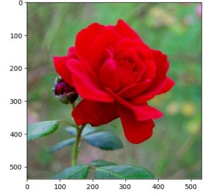
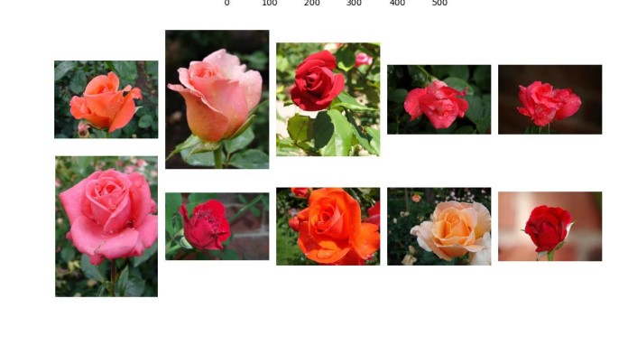

# SimilarityImage

## Table of Contents

1. [Dataset](#dataset)
2. [Model](#model)
3. [How to run](#how-to-run)
4. [Results](#results)

## Dataset

The dataset consists of 102 images of flowers. Here is an example of one of the images:

## Model

The objective of this project is to provide the top 10 most similar images to a given flower image using the A Discriminative Feature Learning Approach for Deep Face Recognition paper. We utilized a combination of the Center loss and Cross Entropy techniques. Finally, we evaluated the model using the ROC-AUC metric.

## How to run

1. The "Prepare" folder contains the data preparation scripts to format the dataset in a similar manner to the LFW dataset. It is not necessary to run these scripts separately.
2. Run ImageSimlarityFinally (3).ipynb [Notebook](model/ImageSimlarityFinally%20(3).ipynb)

## Results

Query Image            |  10 similar images
:-------------------------:|:-------------------------:
  |  
|

